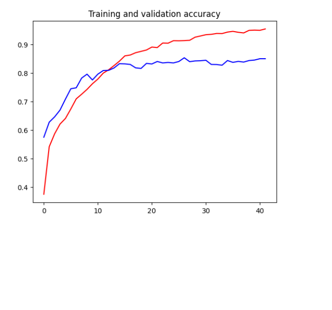
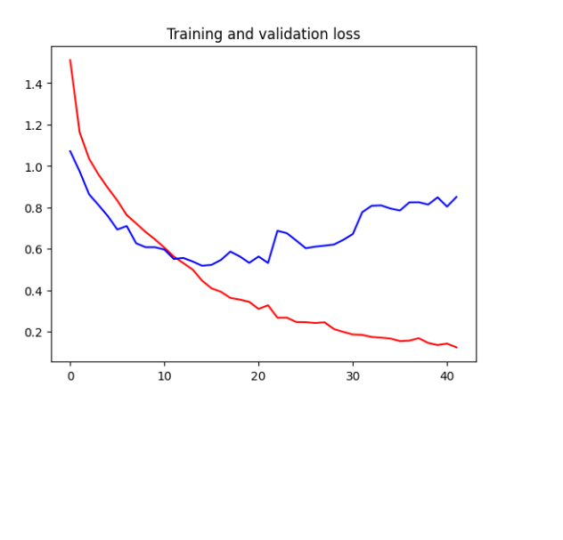

# Multi Class Classification
Objective

Build an Image Classification model to predict the class of the image. A Convolutional Neural 
Network(CNN) will be used to make Multi Class prediction. 

Dataset Description

The dataset consists of images Natural Scenes around the world. This Data contains around 25k 
images of size 150x150 distributed under 6 categories.
• Buildings 0
• Forest 1
• Glacier 2
• Mountain 3
• Sea 4
• Street 5

The Train, Test and Prediction data is separated in each zip files. There are around 14k images 
in Train, 3k in Test and 7k in Prediction.

Model Tuning 
• Without any parameter tunning: No Batch Normalization or dropout is used. 2 Convolutional 
layers are used. Validation accuracy reached 0.78
•  Using Batch Normalization, Validation Accuracy dropped to 0.75 and showed no significant improvement
•  With dropout and 5 Convolutional layers, validation accuracy reached 0.84

Best Accuracy obtained was 84% The prediction suffered when the images categories were overlapping 
e.g. mountains covered with snow, streets with prominent buildings. Multiple Convolutional 
layers with dropout gave the best validation accuracy

